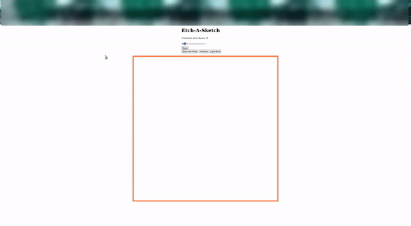

# Etch-A-Sketch

I completed this project to practice javascript DOM manipulation. 

### Functionality

* Mousing over the draw area will fill in divs with color.
* Select color mode: black and white, rainbow, or light black
  * Black and White: fills in solid black squares
  * Rainbow: fills in randomly generated colors
  * Light Black: every mouseover adds 10% opacity to a div.
* The column and row slider builds a css grid according to the slider value.
* Clicking any button or adjusting the slider resets the drawing board

### Demo Video

### Reflection After Completion

I was surprised with how much progress I made early on in the project. I hadn't spent any time figuring out CSS grid before this project, but it was obvious that it was probably the best method to use. I was able to combine that new information with query selectors which felt great.

I also learned why removing things would be important in coding. I always wondered why you would want to remove something before this project. Now I see that one reason why you'd want to do this is because it is one way to reset what's going on in the project.

I also want to note how consistent my progress was. I never got stuck on something for an extra long amount of time. Whenever I got stuck on a problem, it usually took me anywhere from an hour to two hours to work through it. When I was thinking about getting up to go practice coding, I knew that I was stuck, but I never felt hopeless. I always felt as though if I just sit down for an amount of time, of course the solution would present itself!

Now, perhaps my biggest issue with this project was finding where everything belonged.
The biggest thing different about this project was just how many divs I was dealing with. I wasn't just trying to manipulate one div. I was trying to manipulate every div in this container all at the same time. 

It was most difficult to implement the slider. I wanted the amount of rows and columns to be linked with the value of the slider. However, since it was my first time using a slider, I didn't know anything about using them. They have many different attributes, and I wasn't sure how to correctly select what I wanted. Then, I got mixed up with the slider's value and a bunch of other variables. My breakthrough would always come almost exactly a minute after I picked up my white board. For some reason, the whiteboard forces the mind into a much more linear way of thinking that produces results relatively quickly! I think I need to go to my whiteboard quicker. I found that when I changed my slider, the value would move, but it wouldn't influence the amount of columns and rows. I found that I just had to redefine the columns and rows inside of the slider's event listener. I was trying to affect the global value, but that wouldn't work. 
This same thing happened when I was trying to increment the divs' opacity for every mouse over. It would change every single div's opacity to .1 at the same time. I had to move the declaration around so that it would only change one div's opacity at a time.

One thing that I'm very proud of was my ability to implement the buttonEffect(buttonName, backgroundColor) function. I saw that rewriting this code would take a while for each of the three buttons, so I crafted my own function that would take in the name of the button and the background color for each button and execute it when pressed. This allowed each button to use only one line of code, which was extremely satisfying. This is one of the first instances of creation I've succeeded at. I learned the concept, and I understood it well enough to create something unique with it. I remember when functions and their parameters used to blow my mind, but now I'm able to manipulate them and create with them! If I can do that with functions now, I will eventually be able to do this with things that currently feel challenging/overwhelming too.

I also found that it's very interesting to read other people's solutions after completing. I've heard that there are many benefits to reading a lot of code as well as writing it. I feel like I might come back to read many more solutions. I've read through about five now, and none of them are extremely similar to mine, and none of them are extremely similar to each other. These people are still learning like me, so maybe expert programmers would hone in on similar techniques, but it's interesting to see all of the different ways that people come up with!